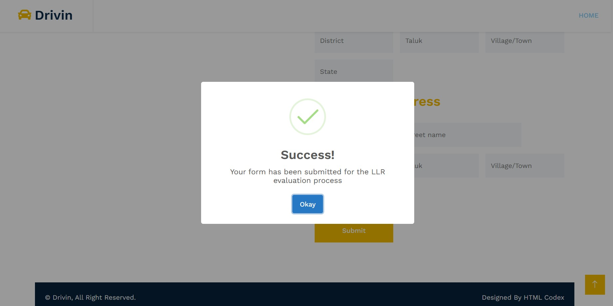
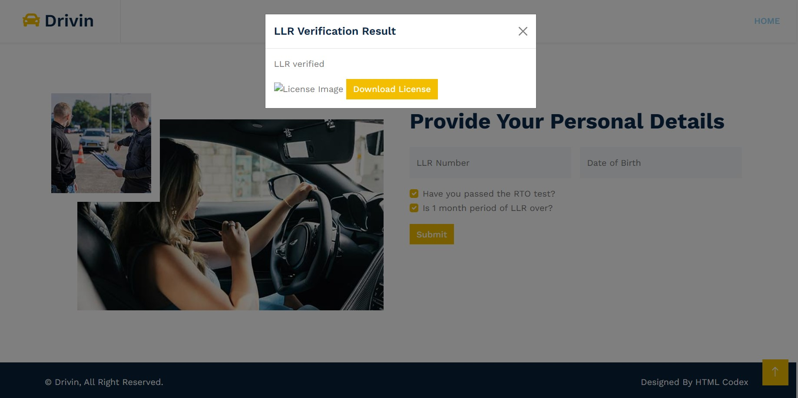
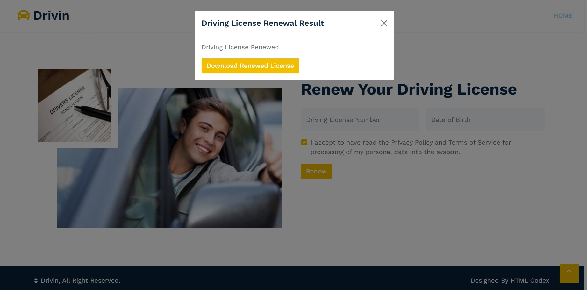
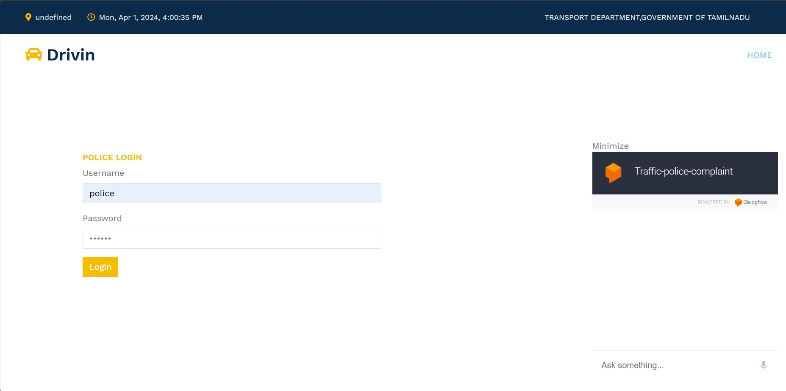
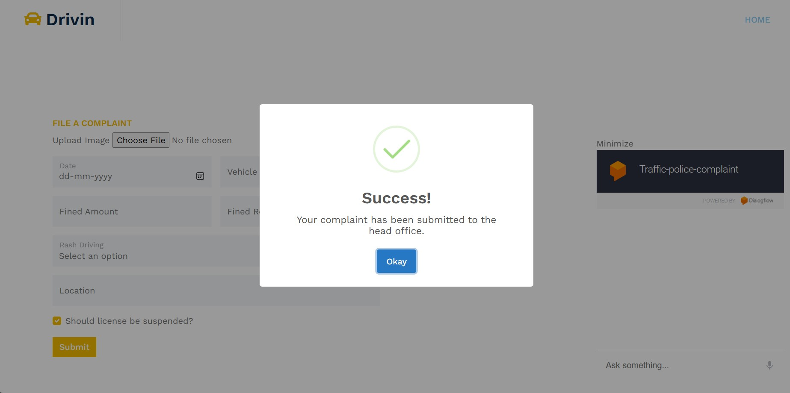
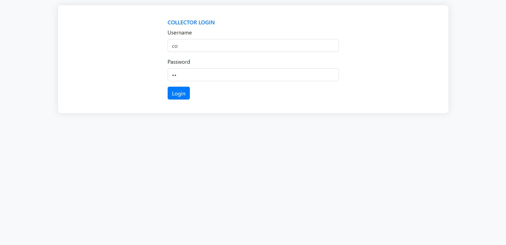
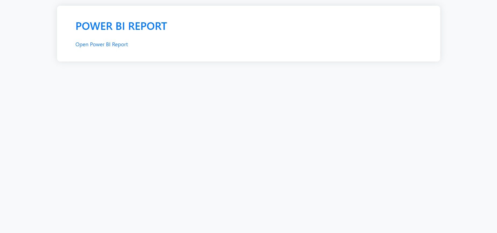

# 🚗 Drivin – Smart Traffic Management & License Assistant

[](LICENSE)

Drivin is a multi-module digital system built to streamline the traffic department's operations. It integrates intelligent chatbot support, OCR-based automation, license verification, complaint filing, and Power BI analytics to modernize vehicle and license-related services in Tamil Nadu.

---

## 📌 Key Features

- 🧠 **Chatbot Integration:**  
  VoiceFlow and Dialogflow-powered chatbot for answering user queries related to LLR, DL, and traffic violations.

- 📄 **Complaint Filing System:**  
  Frontend for uploading rash driving complaints, fine details, and attaching evidence for review by officials.

- 🧾 **Driving License Services:**  
  Includes digital verification of LLR/DL status and downloadable license renewal confirmation.

- 📊 **Collector Dashboard & Power BI Reports:**  
  Visual insights into regional traffic data for quick decision-making.

- 👮 **Police Portal with OCR Automation:**  
  Built-in EasyOCR to extract license plate numbers and automate 80% of the form-filling process for field officials.

---

## 🖥 Tech Stack

| Area             | Tools Used                                        |
|------------------|---------------------------------------------------|
| 💬 Chatbots      | Dialogflow, VoiceFlow                             |
| 🌐 Web Frontend  | HTML, CSS, Bootstrap                              |
| 🧠 AI/OCR        | EasyOCR, Flask                                     |
| 🧾 Backend       | Node.js, Flask, Python                            |
| 📊 Analytics     | Power BI                                          |

---

## 📁 Project Structure

| Module/File                | Description                                           |
|----------------------------|-------------------------------------------------------|
| `flaskfile.py`             | Python Flask OCR backend for image-to-text automation|
| `vehicle.ipynb`            | Jupyter notebook for preprocessing vehicle info       |
| `server.js`                | Node backend for chatbot and portal connections       |
| `cropped_image.jpg` etc.   | Sample license plate images for OCR                  |
| `media/`, `public/`        | Static image and UI assets                           |
| `android/`                 | Mobile application frontend                          |
| `easyocr_model.pkl`        | Trained EasyOCR model                                |

---

## 🧪 Sample Modules in Action

- ✅ **Voiceflow Assistant**
  

- ✅ **LLR Verification**
  

- ✅ **Driving License**
  

- ✅ **Driving License Renewal**
  

- ✅ **Police OCR Portal**
  

- ✅ **Complaint Submission**
  

- ✅ **Collector Login**
  

- ✅ **Power BI**
  

---

## 🚀 How to Run (Example for Flask OCR)

1. Clone the Repository  
   ```bash
   git clone https://github.com/rog-mithun/Drive-in.git
   cd Drive-in

2. Install Dependencies
   ```bash
   pip install flask pytesseract pdfplumber openai

3. Run Flask Server
   ```bash
   python flaskfile.py

---

## 📖 License

This project is licensed under the [MIT License](LICENSE) © 2025 Mithunsankar S.
